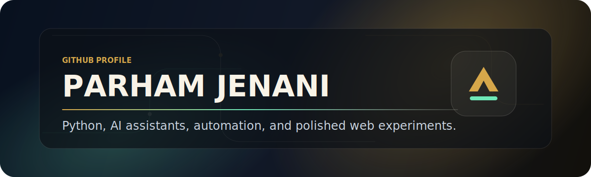

<p align="center">
  
</p>

<h1 align="center">Hi, I'm Parham Jenani</h1>

<p align="center">
  Python-focused builder exploring AI tools, automation, and polished web experiences.
</p>

<p align="center">
  <a href="https://github.com/parhamje?tab=repositories">
    
  </a>
  <a href="https://github.com/parhamje/JarvisAI">
    
  </a>
</p>

---

### What I Care About

```txt
Product thinking    Design taste    Reliable systems    Fast iteration
```

I enjoy turning ideas into practical software: automation scripts, AI assistants, clean frontends, and small tools that remove friction from everyday work.

### Current Focus

- Building AI assistant projects with Python.
- Creating automation around downloads, web access, and workflow shortcuts.
- Improving frontend craft through HTML, CSS, and JavaScript experiments.

### Tech Stack

<p>
  
</p>

### Featured Work

<table>
  <tr>
    <td width="50%">
      <h3>JarvisAI</h3>
      <p>A Python AI assistant project and the newest centerpiece of my public work.</p>
      <p>
        <a href="https://github.com/parhamje/JarvisAI"><strong>Repository</strong></a>
      </p>
    </td>
    <td width="50%">
      <h3>Meli-Action1</h3>
      <p>A Python download and web-saving automation project built for difficult network conditions.</p>
      <p>
        <a href="https://github.com/parhamje/Meli-Action1"><strong>Repository</strong></a>
      </p>
    </td>
  </tr>
  <tr>
    <td width="50%">
      <h3>Jarvis</h3>
      <p>A Python assistant experiment that shows my interest in personal AI tooling.</p>
      <p>
        <a href="https://github.com/parhamje/Jarvis"><strong>Repository</strong></a>
      </p>
    </td>
    <td width="50%">
      <h3>pardisecaffee</h3>
      <p>An HTML web project focused on layout, presentation, and visual structure.</p>
      <p>
        <a href="https://github.com/parhamje/pardisecaffee"><strong>Repository</strong></a>
      </p>
    </td>
  </tr>
</table>

### GitHub Snapshot

<p align="center">
  
  
</p>

<p align="center">
  
</p>

### Operating Principles

- Make the first version real, then improve it with taste.
- Keep the interface quiet, useful, and fast.
- Prefer readable code over clever code.
- Design for the person using the product, not the screenshot.

### Connect

I am open to thoughtful collaborations, product ideas, and engineering conversations.

<p>
  <a href="https://github.com/parhamje">GitHub</a>
  ·
  <a href="https://github.com/parhamje?tab=repositories">Repositories</a>
</p>

---

<p align="center">
  <sub>Built with care, clarity, and a little obsession over details.</sub>
</p>
